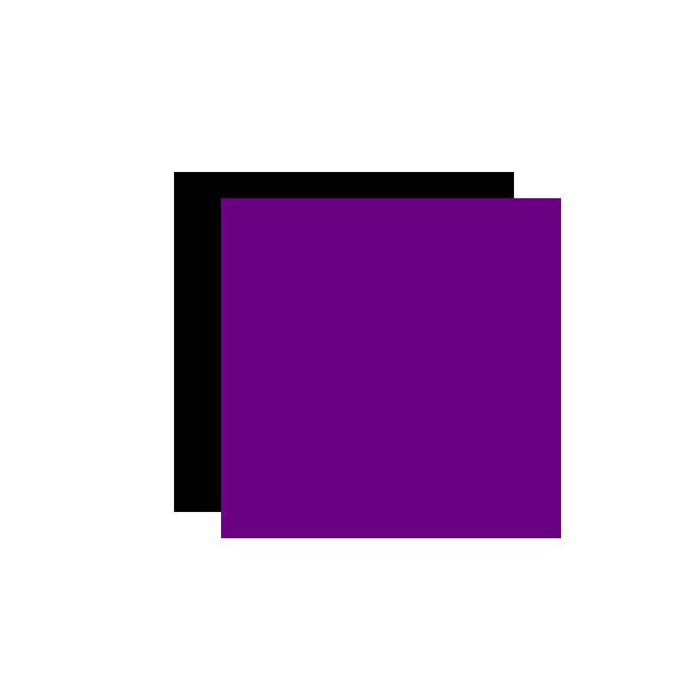
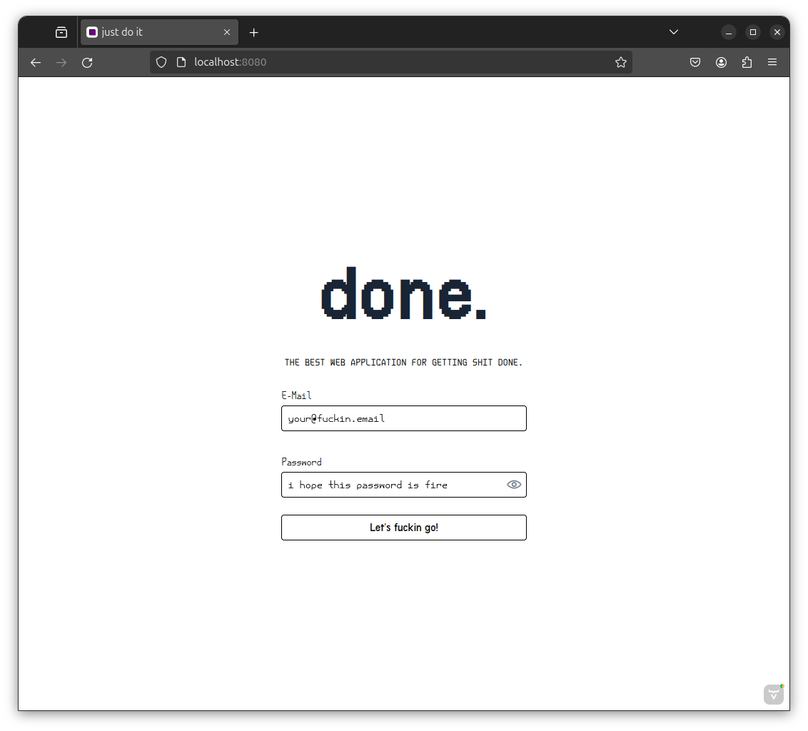
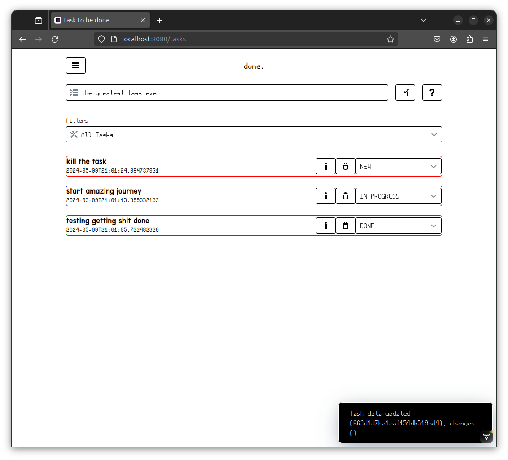
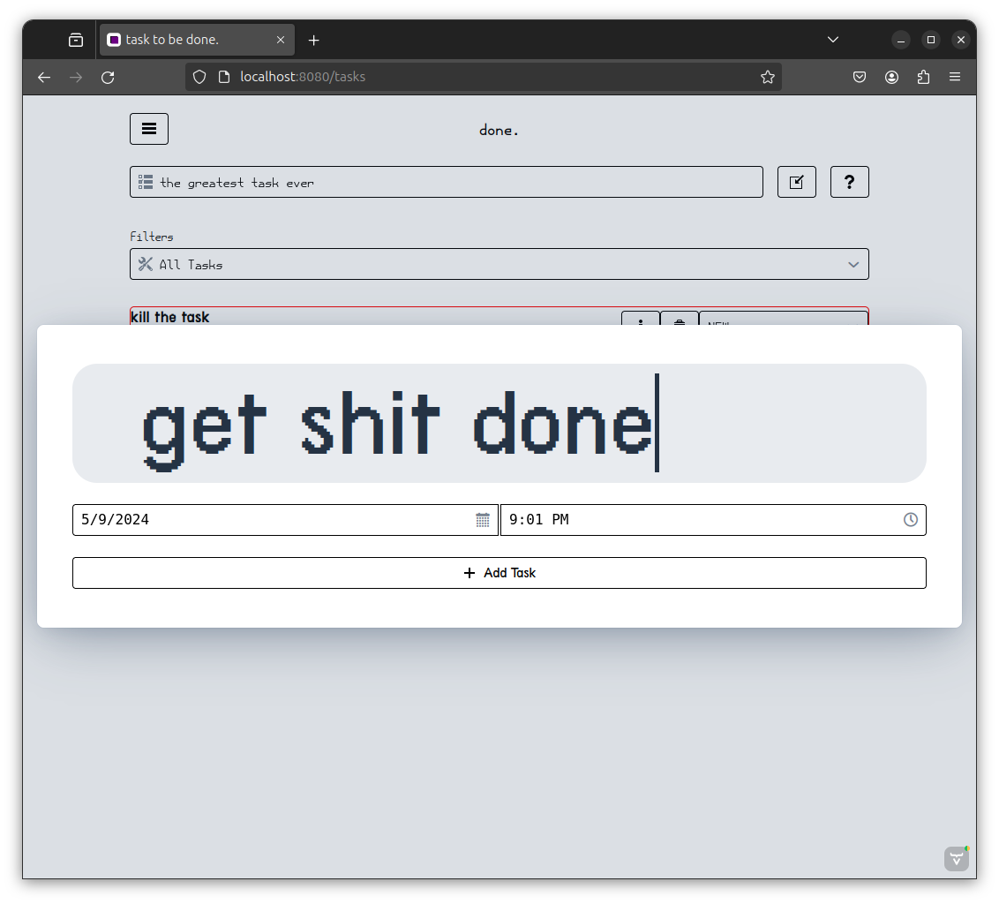
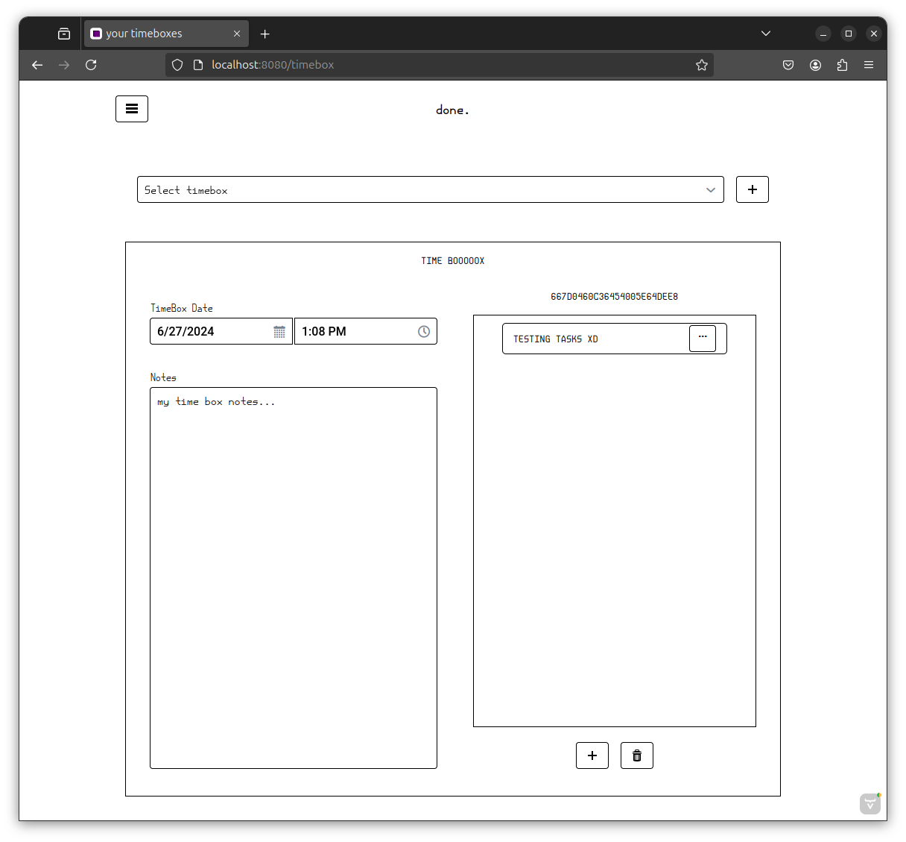
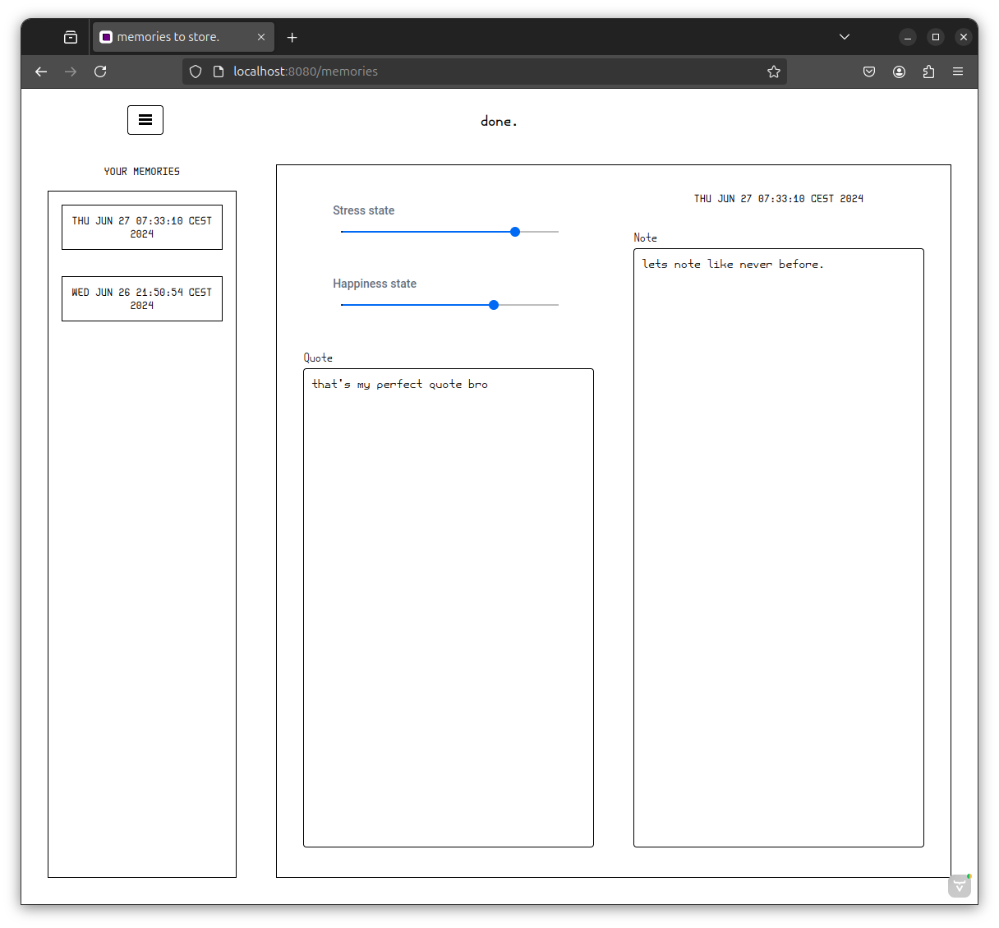
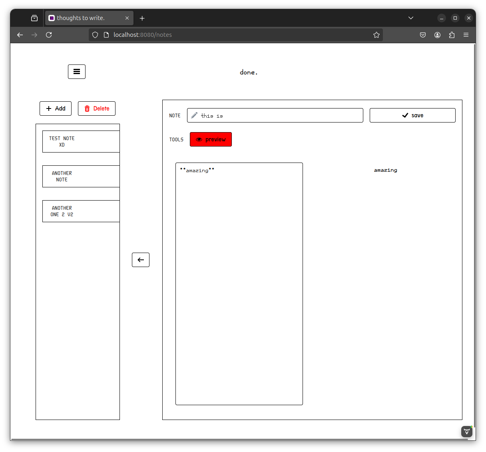

# done
The best web application for getting shit done. No bullshit functions no bullshit layout. 
Straight to the point - just make shit done.

## Technologies Used

This project is built with a variety of technologies:

- **Java**: The main language used for the backend of the application.

- **Spring Boot**: A framework used to simplify the setup and development of the application.

- **Maven**: A build automation tool used primarily for Java projects.

- **JavaScript**: Used for some parts of the application.

- **TypeScript**: A statically typed superset of JavaScript that adds optional types.

- **MongoDB**: The database used to store the tasks.

- **Vaadin**: A platform for building single-page web applications in Java.

## User Interface

The DoneApplication user interface is designed to be simple and straightforward to help you get things done without any distractions.

## First run

The App creates ADMIN account on start if none of the accounts created is admin account - the check is run every time 
instance starts. The mail for the auto admin account is stored in the database, you can check the log entry with
`DB-ADMIN-INSERT` tag or check `done_user` table in database.

## DoneMenu Commands

The DoneMenu class handles user input and executes the corresponding commands. Here's a brief description of the commands and their usage:

- `exit`: This command is used to exit the application. It does not require any additional arguments. Usage: `exit`.

- `register`: This command is used to register a new user. It requires three additional arguments: email, password, telephone and role (ROLES: `USER`,`ADMIN`). The email should be a valid email address, and the password should be more than 8 characters long. Usage: `register <email> <password> <telephone>`.

- `createkey`: This command is used to create a new API key for a user. It requires one additional argument: the user's email. Usage: `createkey <user_email>`.

- `removekey`: This command is used to remove an API key for a user. It requires one additional argument: the user's email. Usage: `removekey <user_email>`.

- `createtoken`: This command is used to create a new token for a user. It requires one additional argument - user email. Usage: `createtoken <user_email>`.

- `mkadmin`: This command is used to make a user an admin. It requires one additional argument - user email. Usage: `mkadmin <user_email>`.

- `mkuser`: This command is used to make a user a user. It requires one additional argument - user email. Usage: `mkuser <user_email>`.

- `resetpass`: This command is used to reset a user's password. It requires two additional arguments: the user's email and the new password. Usage: `resetpass <user_email`

- `lock`: This command is used to lock a user's account. It requires one additional argument: the user's email. Usage: `lock <user_email>`.

- `unlock`: This command is used to unlock a user's account. It requires one additional argument: the user's email. Usage: `unlock <user_email>`.

- `terminal`: This command is used to display a terminal prompt. It does not require any additional arguments. Usage: `terminal`.

- `debug`: This command is used to display a debug prompt. It does not require any additional arguments. Usage: `debug`.

### Administration using Web UI

The web UI provides an easy way to manage users, tasks, and API keys. You can create new users, update user roles, reset passwords, and lock/unlock accounts.

### Main Page

When you open the application, you'll see the main page. This page displays a list of your tasks. Each task has a title and a checkbox that you can use to mark the task as done.

### API Endpoints

Main endpoints:
- `/api/health`
- `/api/token/create/{api_key}/{api_code}`
- `/api/token/validate/{token}`

Task endpoints:
- `/api/task/create/{token}/{task_title}`
- `/api/task/list/{token}`

### Adding a Task
 
To add a new task, click on the "Add Task" button located at the top of the main page. This will open a form where you can enter the title of your new task. After entering the title, click on the "Save" button to add the task to your list.

### Deleting a Task

To delete a task, click on the "Delete" button next to the task in the list. This will remove the task from your list.

Remember, the goal of DoneApplication is to help you get things done. So, keep your task list up-to-date and try to complete your tasks as soon as possible.

### Creating TimeBox

Timeboxing is a time management technique that involves allocating a fixed amount of time to complete a task or activity.
It can be used for individual tasks or entire projects. The goal of timeboxing is to improve focus, increase productivity,
and reduce procrastination by creating a sense of urgency and limiting distractions.

### Creating Memories

Every day when you log to the application done creates an empty memory object for you. You can fill it with your thoughts, ideas, 
or anything you want to remember.

### Creating Notes

Notes are a great way to organize your thoughts, ideas, and information.
You can create notes for different topics, projects, or tasks.

# DoneApplication

DoneApplication is a task management application built with Java, Spring Boot, and Maven. It also uses JavaScript and TypeScript for some parts of the application.

## Overview

The application allows users to manage their tasks effectively. Users can add new tasks, update existing tasks, and load tasks from the database. The tasks are stored in a MongoDB database.

## Key Classes

- `DoneApplication`: This is the main class of the application. It connects to the database and runs the web application and menu if the database connection is successful.

- `DatabaseTask`: This class is responsible for performing database operations related to tasks. It can insert new tasks, update existing tasks, and load tasks from the database.

- `TaskDataManager`: This class is responsible for managing task data on the database. It can insert new tasks into the database.

## Getting Started

To get started with the DoneApplication, you need to provide the database URL as an argument when running the application. The application will connect to the database and start the web application and menu.

## Contributing

Contributions are welcome. Please feel free to fork the project and submit a pull request with your changes.

## License

DoneApplication is open-source software licensed under the MIT license.